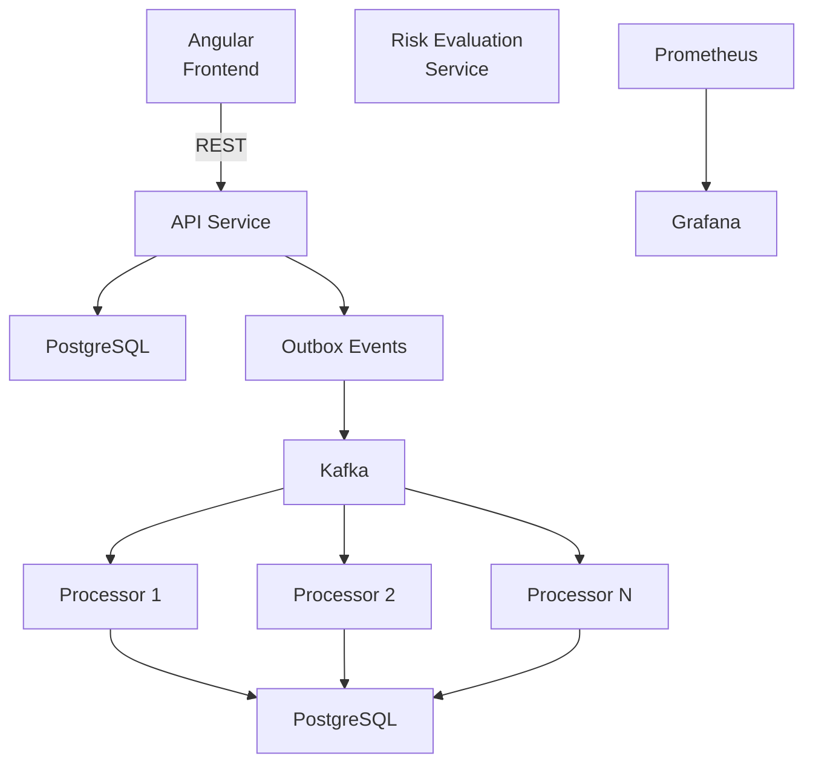

# Transaction Processing Platform

**Short name:** `Trans-Process-Platf`

**GitHub:** [https://github.com/nic0michael/Trans-Process-Platf](https://github.com/nic0michael/Trans-Process-Platf)

## Overview

The **Transaction Processing Platform** is a Java/Angular full-stack project designed to demonstrate the design and implementation of a reliable, scalable and observable transaction-processing system.

The project is being developed as a **design-first software engineering exercise**.

The emphasis is not simply on writing application code. The project starts with understanding the problem, defining requirements, evaluating architectural alternatives, making explicit architecture decisions, designing the solution, and then implementing it using TDD.

The platform is designed to run on a laptop using Docker and Docker Compose, while maintaining an architecture that can later be deployed to Kubernetes.

**This Project is built using Architecture Best Practices:**
- Every **Design or Architectural Decision** is made in an architecture meeting and appears in the minutes.
- These Architectural Decisions are then **recorded in our Architectural Decisions Register**
- We decided to use Maiden UML Diagrams as GitHub and the Chrome Browser support Maiden diagrams.
- We follow **IBM GS Method for our methodology**, as its scope covers the whole life-cycle of the project providing a complete set of Artifacts.

**In this project, we used two Design Patterns:**
- The **OutBox pattern** using an Asynchronous service to connect to an external slow service and guarantee there are no duplicate transactions
- The **VETO patern** a popular Service Design pattern

---

# Project Goals

The project has two main goals:

1. Build a realistic transaction-processing platform.
2. Demonstrate a professional approach to software architecture and engineering.

The platform will demonstrate:

* Java 21
* Spring Boot
* Angular
* REST APIs
* PostgreSQL
* Apache Kafka
* asynchronous processing
* idempotent transaction processing
* Outbox Pattern
* retry and dead-letter processing
* database indexing
* service virtualization
* fault injection
* contract testing
* unit and integration testing
* performance testing
* Docker
* Kubernetes-ready deployment
* observability
* Mongo for NonSQL database
* Gradle multi-project builds
* A Swagger is added for Local testing of the backend

---

# Architecture

The high-level architecture separates the user-facing API from the asynchronous transaction-processing workload.
Certainly. Here is the equivalent Mermaid diagram, keeping the structure of your original diagram:



One important observation: **Risk Evaluation Service** and **Prometheus/Grafana** are currently shown as standalone components in your original diagram—they don't have connections to the main transaction flow. I have preserved that rather than inventing relationships.


```text
                         +----------------+
                         |    Angular     |
                         |    Frontend    |
                         +-------+--------+
                                 |
                                 | REST
                                 v
                         +---------------+
                         |   API Service |
                         +-------+-------+
                                 |
                    +------------+------------+
                    |                         |
                    v                         v
             +-------------+          +---------------+
             | PostgreSQL  |          | Outbox Events |
             +-------------+          +-------+-------+
                                             |
                                             v
                                      +-------------+
                                      |    Kafka    |
                                      +------+------+
                                             |
                              +--------------+--------------+
                              |              |              |
                              v              v              v
                         Processor 1    Processor 2    Processor N
                              |              |              |
                              +--------------+--------------+
                                             |
                                             v
                                      +-------------+
                                      | PostgreSQL  |
                                      +-------------+

                         +----------------------+
                         | Risk Evaluation      |
                         | Service              |
                         +----------------------+

                         +-------------+
                         | Prometheus  |
                         +------+------+
                                |
                                v
                         +-------------+
                         |  Grafana    |
                         +-------------+
```

The design separates:

* **request handling**
* **persistent transaction state**
* **event publication**
* **asynchronous processing**
* **external service interaction**
* **monitoring**

This allows the system to demonstrate how an application can remain responsive while processing work asynchronously.

---

# Transaction Processing

A transaction moves through a defined lifecycle:

```text
RECEIVED
   |
   v
VALIDATED
   |
   v
QUEUED
   |
   v
PROCESSING
   |
   +----------+
   |          |
   v          v
COMPLETED   FAILED
              |
              v
            RETRY
              |
         +----+----+
         |         |
         v         v
    PROCESSING   DEAD_LETTER
```

The system is designed to prevent duplicate processing through an idempotency mechanism based on a unique request identifier.

---

# Event-Driven Processing

Apache Kafka is used as the asynchronous event platform.

The primary transaction topic is:

```text
transaction-events
```

Additional topics support retry and failure processing:

```text
transaction-retry
transaction-dlq
transaction-results
```

Kafka partitions and consumer groups are part of the architecture.

Transactions are partitioned using a defined business key so that related events can maintain ordering while allowing transactions from different customers to be processed in parallel.

Consumer groups allow multiple transaction processors to share the processing workload.

---

# Reliable Event Publication

The platform uses the **Outbox Pattern**.

The transaction and its corresponding event are persisted together before the event is published to Kafka.

This avoids a situation where the database transaction succeeds but the corresponding event is lost.

The Outbox also provides a durable record of events waiting to be published.

---

# Resilience

The platform is designed to demonstrate failure handling rather than only the successful processing path.

The design includes:

* retries
* retry topics
* dead-letter topics
* idempotency
* controlled failure scenarios
* external-service failures
* timeout handling
* processor failures
* database failures
* Kafka failures

A simulated Risk Evaluation Service provides a controlled external dependency for testing resilience.

---

# Testing Strategy

Testing is treated as part of the architecture rather than something added after implementation.

The project will use several levels of testing:

```text
Unit Tests
     |
     v
Integration Tests
     |
     v
Contract Tests
     |
     v
Fault Injection
     |
     v
Performance Tests
```

The objective is to test both individual components and the behaviour of the complete distributed workflow.

The project will also include deterministic failure scenarios so that retry and recovery behaviour can be tested repeatedly.

---

# Performance

The asynchronous architecture allows the API response time to be considered separately from the actual transaction-processing time.

Performance testing will measure:

* throughput
* response time
* 95th percentile
* 99th percentile
* processing time
* error rate
* Kafka consumer lag

JMeter will be used to generate controlled workloads.

---

# Observability

The platform will provide application and infrastructure visibility through:

* structured logging
* application metrics
* transaction processing metrics
* Kafka metrics
* consumer lag
* health checks
* Prometheus
* Grafana

Correlation IDs will allow a transaction to be followed across the API, Kafka, processor and database.

---

# Architecture and Design Process

The project follows a deliberate architecture-first process:

```text
Requirements
     |
     v
Architecture
     |
     v
Architecture Decisions
     |
     v
Detailed Design
     |
     v
TDD
     |
     v
Implementation
     |
     v
Integration Testing
     |
     v
Performance Testing
     |
     v
Deployment
```

Architecture meetings are used to discuss significant design questions before implementation.

The purpose is to understand the problem, consider alternatives and trade-offs, make a decision, and record the reasoning behind that decision.

---

# Architecture Decision Records

Significant architectural decisions are recorded using **Architecture Decision Records (ADRs)**.

The ADRs form an Architecture Decision Register for the project and provide a history of important decisions, their context, alternatives and consequences.

Examples include decisions concerning:

* Java and Spring Boot
* Gradle
* PostgreSQL
* Kafka
* Kafka partitioning
* consumer groups
* asynchronous processing
* Outbox Pattern
* idempotency
* observability
* Docker
* Kubernetes

The ADR approach provides traceability between architecture discussions and the resulting implementation. ADRs are commonly used to capture the context, decision and consequences of significant architectural choices. ([GitHub][2])

---

# Technology Stack

## Backend

* Java 21
* Spring Boot
* Spring Web
* Spring Data JPA
* Spring Validation
* Spring for Apache Kafka
* Spring Actuator
* PostgreSQL

## Frontend

* Angular
* TypeScript
* RxJS

## Messaging

* Apache Kafka

## Build

* Gradle
* Gradle Wrapper
* Gradle multi-project build

## Testing

* JUnit
* Mockito
* AssertJ
* Testcontainers
* Contract Testing
* JMeter
* JaCoCo
* SonarQube

## Infrastructure

* Docker
* Docker Compose
* Kubernetes
* Helm
* Prometheus
* Grafana

---

# Project Structure

The repository is organised to keep architecture, application code, testing and infrastructure clearly separated.

```text
Trans-Process-Platf/
│
├── architecture/
│   ├── adr/
│   ├── diagrams/
│   └── requirements/
│
├── backend-api/
│
├── backend-processor/
│
├── backend-common/
│
├── backend-test-support/
│
├── frontend/
│   └── angular/
│
├── tests/
│   ├── integration/
│   ├── contract/
│   ├── performance/
│   └── fault-injection/
│
├── infrastructure/
│   ├── docker/
│   ├── compose/
│   └── kubernetes/
│
├── docs/
│
├── gradle/
│   └── wrapper/
│
├── build.gradle
├── settings.gradle
├── gradlew
├── gradlew.bat
└── README.md
```

---

# Local Development

The complete initial platform is designed to run on a laptop using Docker.

The local environment will contain:

```text
Angular
API
Transaction Processor
PostgreSQL
Kafka
Prometheus
Grafana
```

The architecture is intentionally designed so that the local environment can later evolve into a Kubernetes deployment without fundamentally changing the application design.

---

# Future Deployment

Kubernetes deployment will be addressed after the application and testing phases.

The planned deployment architecture includes:

* Kubernetes
* multiple API replicas
* multiple transaction processors
* Kafka
* PostgreSQL
* ingress
* readiness probes
* liveness probes
* autoscaling
* secrets management
* monitoring

The Kubernetes design will specifically consider the relationship between Kafka partitions, consumer groups, processor replicas and consumer lag.

---

# What This Project Demonstrates

This project demonstrates more than a working application.

It demonstrates the complete engineering process:

```text
Understand the Problem
        |
        v
Analyse Requirements
        |
        v
Evaluate Alternatives
        |
        v
Make Architecture Decisions
        |
        v
Record Decisions
        |
        v
Design the Solution
        |
        v
Build Using TDD
        |
        v
Test
        |
        v
Measure
        |
        v
Deploy
```

The objective is to produce a system where the **architecture and the reasoning behind the architecture are as important as the code itself**.

This version keeps the ADR material intentionally brief and lets the actual `architecture/adr/` files demonstrate the depth of the decision-making process. ([GitHub][2])

[1]: https://github.com/nic0michael/Trans-Process-Platf "nic0michael/Trans-Process-Platf · GitHub"
[2]: https://github.com/architecture-decision-record/architecture-decision-record?utm_source=chatgpt.com "GitHub - architecture-decision-record/architecture-decision-record: Architecture decision record (ADR) examples for software planning, IT leadership, and template documentation · GitHub"

