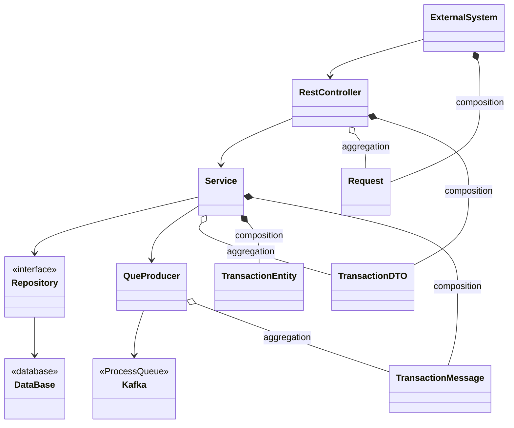

```mermaid
classDiagram

    class ExternalSystem
    class RestController
    class Service
    class Repository {
        <<interface>>
    }
    class DataBase {
        <<database>>
    }
    class QueProducer
    class Kafka {
        <<ProcessQueue>>
    }
    class Request
    class TransactionDTO
    class TransactionEntity
    class TransactionMessage

    ExternalSystem --> RestController
    RestController --> Service
    Service --> Repository
    Repository --> DataBase

    Service --> QueProducer
    QueProducer --> Kafka

    ExternalSystem *-- Request : composition
    RestController o-- Request : aggregation
    RestController *-- TransactionDTO : composition

    Service o-- TransactionDTO : aggregation
    Service *-- TransactionEntity : composition
    Service *-- TransactionMessage : composition

    QueProducer o-- TransactionMessage : aggregation
```
