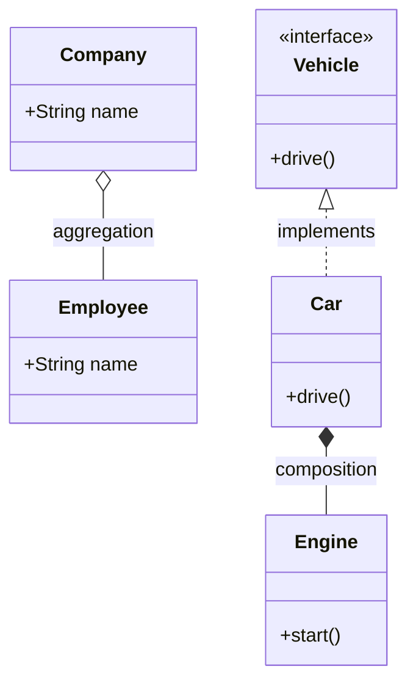

```mermaid
classDiagram

    class Company {
        +String name
    }

    class Employee {
        +String name
    }

    class Engine {
        +start()
    }

    class Car {
        +drive()
    }

    class Vehicle {
        <<interface>>
        +drive()
    }

    Company o-- Employee : aggregation
    Car *-- Engine : composition
    Vehicle <|.. Car : implements
```

---

