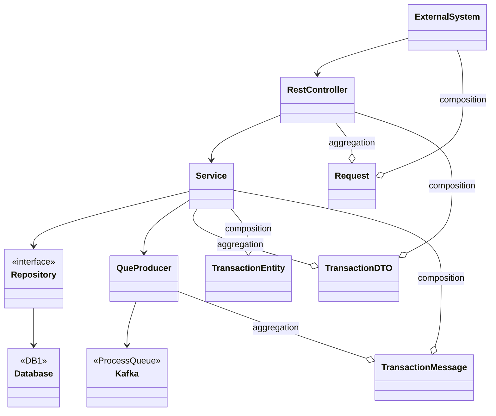

```mermaid id="k8m2qp"
classDiagram

    class ExternalSystem
    class RestController
    class Service
    class Repository {
        <<interface>>
    }

    class Database {
        <<DB1>>
    }

    class QueProducer
    class Kafka {
        <<ProcessQueue>>
    }

    class Request
    class TransactionDTO
    class TransactionEntity
    class TransactionMessage

    ExternalSystem --> RestController
    RestController --> Service
    Service --> Repository
    Repository --> Database

    Service --> QueProducer
    QueProducer --> Kafka

    ExternalSystem --o Request : composition
    RestController --o Request : aggregation
    RestController --o TransactionDTO : composition

    Service --o TransactionDTO : aggregation
    Service --o TransactionEntity : composition
    Service --o TransactionMessage : composition

    QueProducer --o TransactionMessage : aggregation
```
