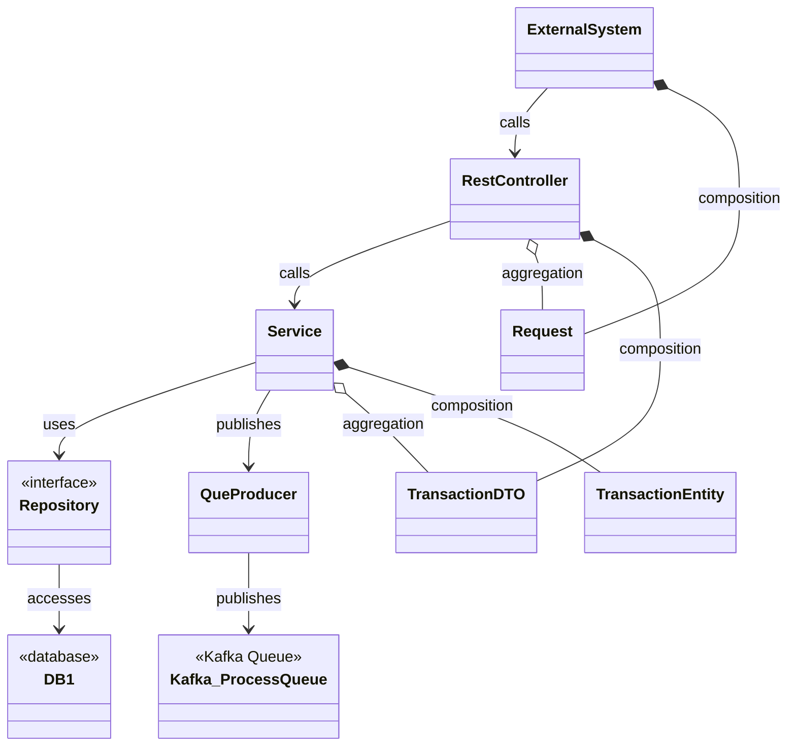

```mermaid
classDiagram

    class ExternalSystem {
    }

    class RestController {
    }

    class Service {
    }

    class Repository {
        <<interface>>
    }

    class DB1 {
        <<database>>
    }

    class QueProducer {
    }

    class Kafka_ProcessQueue {
        <<Kafka Queue>>
    }

    class Request {
    }

    class TransactionDTO {
    }

    class TransactionEntity {
    }

    ExternalSystem --> RestController : calls
    RestController --> Service : calls
    Service --> Repository : uses
    Repository --> DB1 : accesses

    Service --> QueProducer : publishes
    QueProducer --> Kafka_ProcessQueue : publishes

    ExternalSystem *-- Request : composition
    RestController o-- Request : aggregation
    RestController *-- TransactionDTO : composition

    Service o-- TransactionDTO : aggregation
    Service *-- TransactionEntity : composition
```
